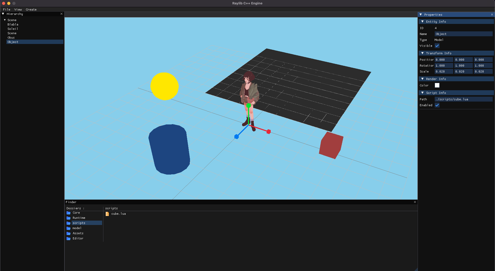

<div align="center">
  
  
  # rlEngine
  
  **A lightweight Engine**
  
  [](https://opensource.org/licenses/MIT)
  [](https://isocpp.org/)
  
  [](https://cmake.org/)
  [](https://www.raylib.com/)
  
  
</div>

## WARNING
This project is in its early stages of development.
It is not yet ready for production use and may contain bugs or incomplete features. Use at your own risk!

# Features
- A simple Entity Component System (ECS) to manage game objects.
- A scene editor to create and edit scenes.
- A scripting system to add custom behavior to entities.

# Prerequisites
- CMake 3.15 or higher 
- C++20
- [raylib](https://www.raylib.com/)
- [nlohmann/json](https://github.com/nlohmann/json)
- [Lua](https://www.lua.org/)

# Installation
## 1. Clone the repository:
```bash
git clone git@github.com:MelmanC/GameEngine.git
```

## 2. Run cmake to generate the build files and download most of the dependencies:
```bash
cmake -B .build && cmake --build .build
```

## 3. Run the editor:
```bash
./EditorApp
```

# Dependencies
- [raylib](https://www.raylib.com/) - A simple and easy-to-use library to create games.
- [raylib-cpp](https://github.com/RobLoach/raylib-cpp) - C++ wrapper for raylib.
- [nlohmann/json](https://github.com/nlohmann/json) - A JSON library for C++.
- [ImGui](https://github.com/ocornut/imgui) - A bloat-free graphical user interface library for C++.
- [rlImGui](https://github.com/raylib-extras/rlImGui) - A raylib binding for ImGui.
- [Lua](https://www.lua.org/) - A scripting language for game development.
- [Sol3](https://github.com/ThePhD/sol2) - A C++ library binding for Lua, providing a simple and efficient way to integrate Lua scripting into C++ applications.

# Contributing
Contributions are welcome! Please read the [contributing guidelines](CONTRIBUTING.md)
before submitting a pull request.

# License
This project is licensed under the MIT License

# Special Thanks
- [A Simple Entity Component System (ECS) by Austin Morlan](https://austinmorlan.com/posts/entity_component_system/)

